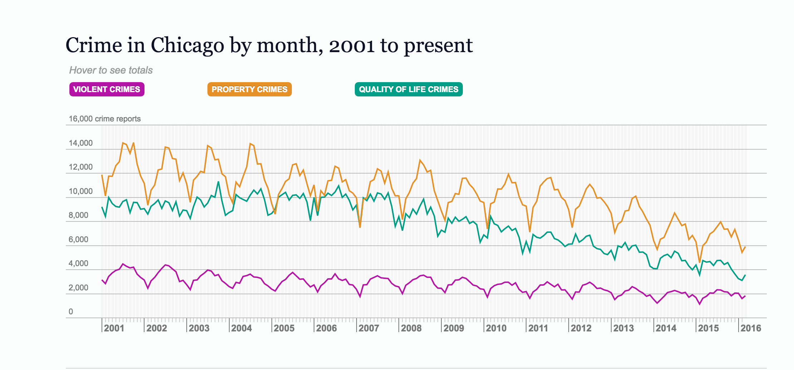
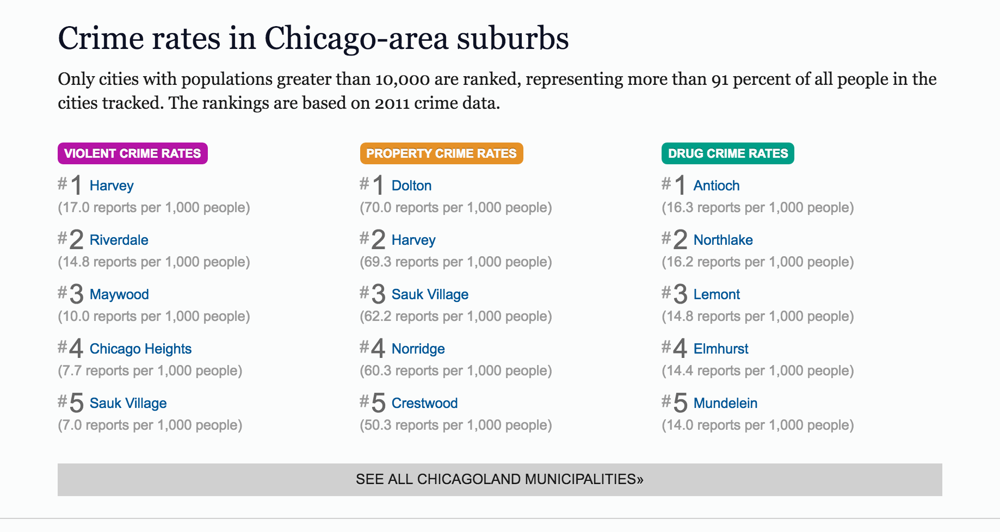

# Concept and documentation

## App name: Chicago Crime Mapper

## Elevator pitch

We have so much crime data in Chicago but virtually no one can make sense from the flood of information. So let's build a site that organizes the massive crime data in a way that the Chicago citizen can understand: not raw numbers, but trends based on neighborhood.

People just need to see the wide picture -- is crime happening more than it did last month -- and the big picture: is crime lower this year than it was last year?

## Inspirations and Prior Work

- [Socrata's Chicago Crime data portal](https://data.cityofchicago.org/view/5cd6-ry5g)
  + The Socrata site serves best as a place to quickly find and download the data, but its visualization tools don't offer enough freedom.
  + I could design my site to read directly from the Socrata API, saving me the trouble of downloading and storing gigs of data. However, I think I need to do a one-time download of archival data to get a feel of what the main crime categories are.
- [Homicide Inequality in Chicago—In Maps](https://newrepublic.com/article/118003/maps-crime-chicago-crime-different-neighborhoods)
  + This article focuses on homicides, so the data is not as plentiful as the raw crime data.
  + However, it's a good idea to juxtapose crime data with Census data that indicates poverty and demographics, just to see how correlated crime activity is with a neighborhood's situation.
- [In memory of chicagocrime.org](http://www.holovaty.com/writing/chicagocrime.org-tribute/)
  + Hard to imagine mapping data without Google's API!
  + Glad I just have to pull data from a CSV's URL instead of reverse-engineering JavaScript.
- [San Jose PD CrimeReports app](http://www.sjpd.org/CrimeStats/CrimeReports.html)
  + This app is horrible.
  + It's slow, too many icons, too hard to discern trends.
  + Will cause me to get carpal tunnel syndrome from all the clicking.

# Data

## Data sources

1. The Chicago police department maintains a massive feed of its report data, dating back to 2001, accessible via Socrata: [https://data.cityofchicago.org/Public-Safety/Crimes-2001-to-present/ijzp-q8t2](https://data.cityofchicago.org/Public-Safety/Crimes-2001-to-present/ijzp-q8t2)
2. Municipality shapefiles for Chicago, which will be helpful for showing users the boundaries of neighborhoods, e.g. Loyola and The Loop. I don't think the crime data has a field for "municpality", but we can join the two tables together via shapefile and geocoordinates: [http://www.cityofchicago.org/city/en/depts/doit/dataset/boundaries_-_surroundingmunicipalities.html](http://www.cityofchicago.org/city/en/depts/doit/dataset/boundaries_-_surroundingmunicipalities.html)

## Slimming down the data

The Chicago record set is millions of records. However, it might be possible to group the records, first by neighborhood, then by category of crime, e.g. "violent" or "property", then group them by month, so that our dataset consists of just month-by-month tallies of categorized crimes

## Creating a categorical variable

Create a column named `category` that will be either just 'violent', 'property', or 'quality_of_life' -- those 3 broad categories of crime are enough to start with. 

The tricky part is: how do we easily classify the crime reports into those 3 broad buckets?

## Creating a continuous variable

With the municipalities data, we can get a population estimate for an area. This means we can calculate rate of crimes per 100K people, which is going to be a more meaningful statistic than raw count of crime.

## Joining two datasets

The Chicago crime reports data can be joined to the municipalities shapefiles by using PostGIS type queries (i.e. which crimes have lat/lng that fall within a municipality's boundary shapefile?)

# Filtering options

## Attributes to search/find by

- Allow the user to [select community area via a dropdown box/menu](http://crime.chicagotribune.com/chicago/community/auburn-gresham)
- Allow the user to type in an address; we will call Google Geocoder to send the user to the correct neighborhood.

# Views and Routes

# Visualizations
We got more of these than we can count:

## Charts

A line chart showing data by month and year, between the 3 categories of crime.

## Tables

Here's a table of tables, each one showing the user very quickly which are the most problematic neighborhoods.

# Deployment

Blah blah I put it up on Amazon EC2 or something...
